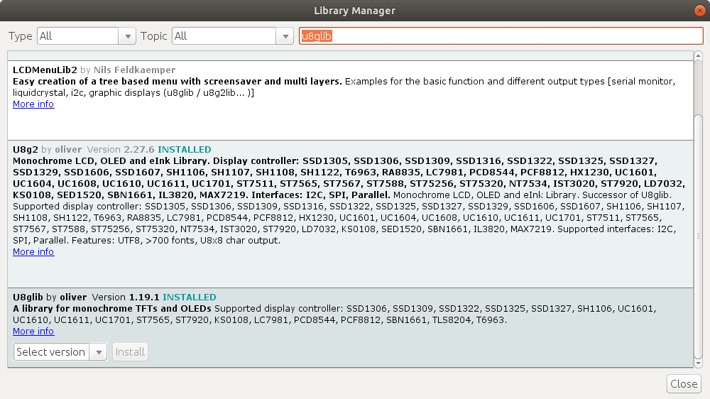

# Firmware Setup
## Firmware
Clone repository

Copy the `TH3DUF_R2` folder into the Arduino folder

Open `TH3DUF_R2.ino` with Arduino IDE

## Arduino IDE settings
### Add Sanguino repository

Select `File -> preferences`

Select  at the end of the "Additional Board Manager URLs" line

Add `https://raw.githubusercontent.com/Lauszus/Sanguino/master/package_lauszus_sanguino_index.json` on a new line

### Install Sanguino board package

Select `Tools -> Board... -> Boards Manager`

Install the `Sanguino` board package

Select `Tools -> Board... -> Sanguino`

Select `ATmega1284 or ATmega1284P (8 MHz)`

### Install U8glib library

Select `Tools -> Manage Libraries`

Install the `U8glib` library
