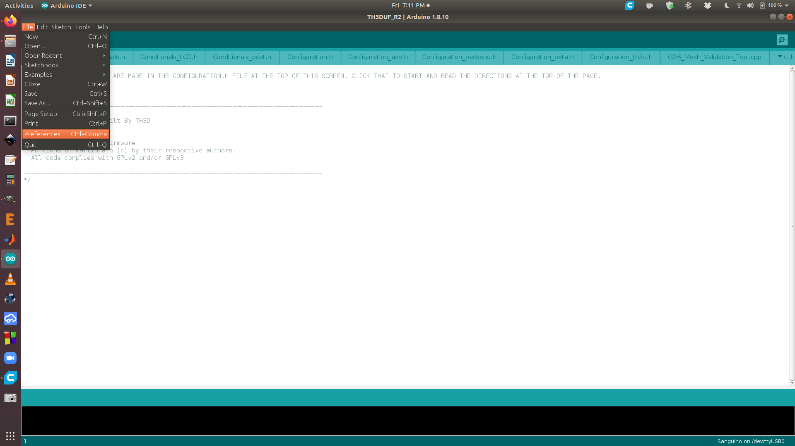
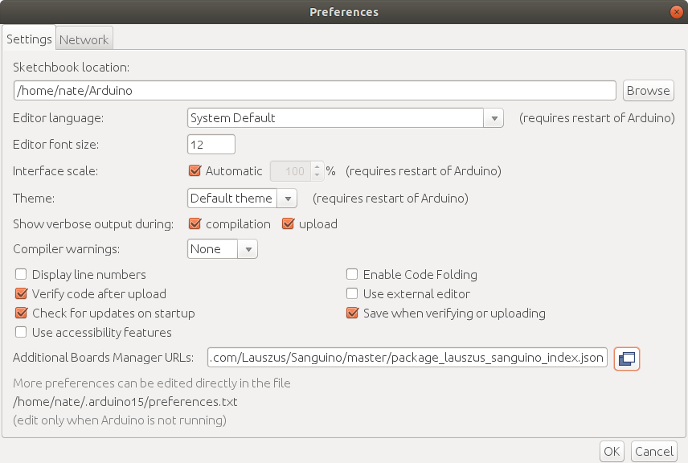
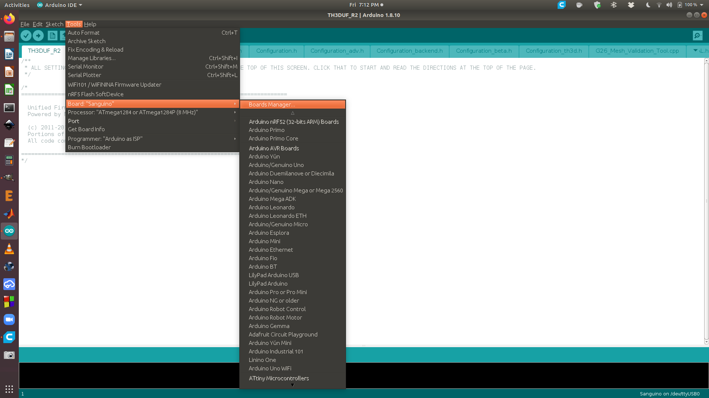
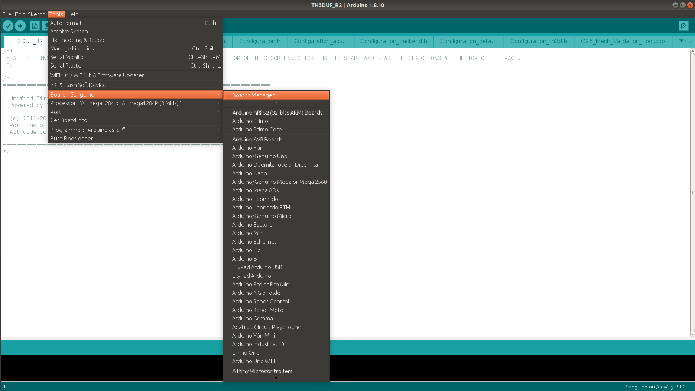
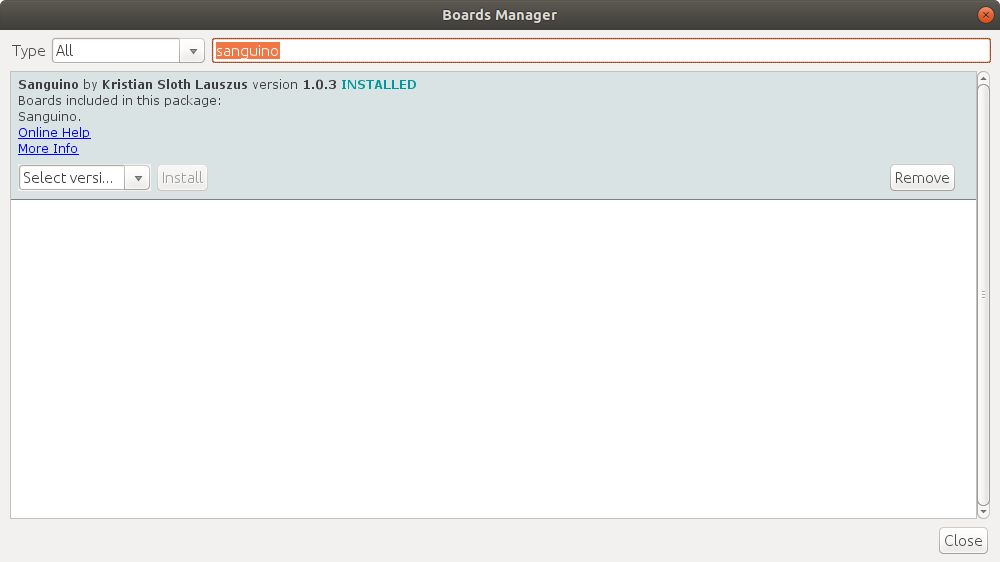
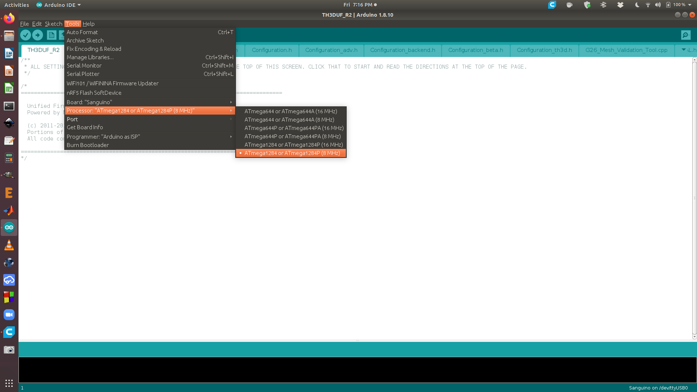
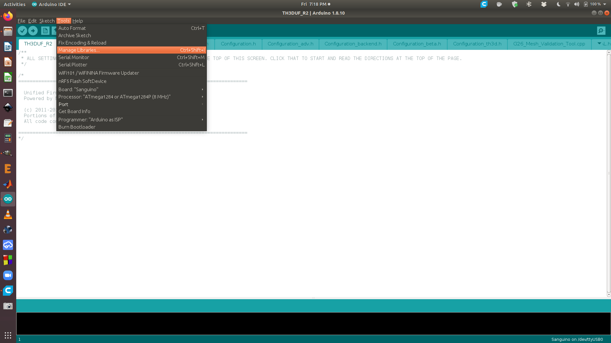
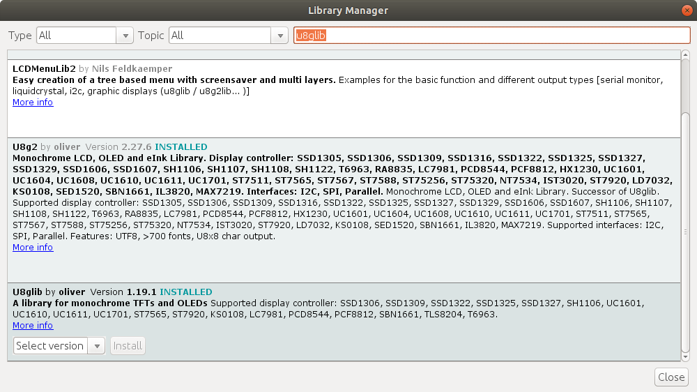

# Ender-3-Modifications
## Add sanguino repository

Select `File -> preferences`

Select  at the end of the "Additional Board Manager URLs" line

Add `https://raw.githubusercontent.com/Lauszus/Sanguino/master/package_lauszus_sanguino_index.json` to the end of the text

## Install sanguino board package

Select `Tools -> Board... -> Boards Manager`

Install the `Sanguino` board package

Select `Tools -> Board... -> Sanguino`

Select `ATmega1284 or ATmega1284P (8 MHz)`

## Install U8glib library

Select `Tools -> Manage Libraries`

Install the `U8glib` library
